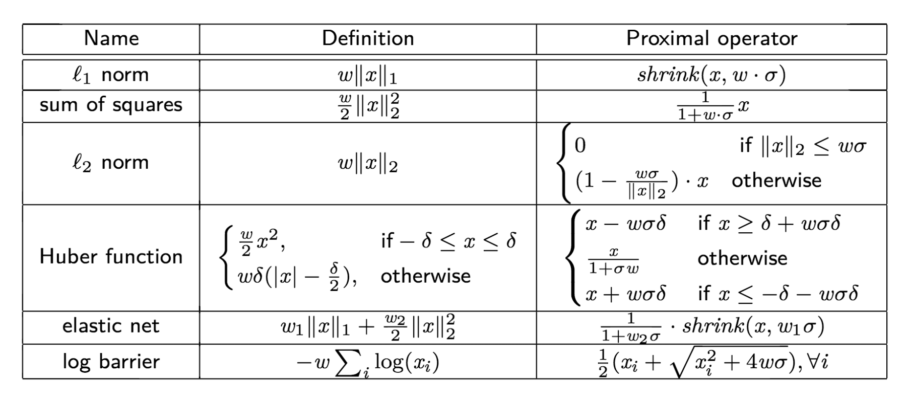
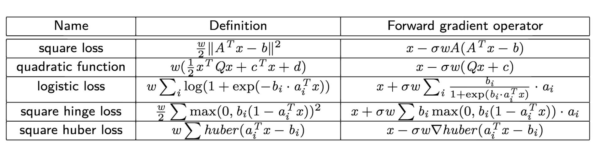

Operators
==========
We provide a total of 17 coordinate friendly operators. We categorize them into three classes: proximal operator, projection operator, and forward operator. The following is the general structure for the operators. You can use it as a template to add more operators.

.. code-block:: c++
		
    struct functor_name {
      // the step_size that associated with the operator  
      double step_size;
      // weight on the original function, e.g., f(x) = weight ||x||_1
      double weight;      
 
      // returns the operator evaluated on v at the given index
      double operator() (Vector* v, int index) {
 
      }

      // (Optional) update the cached variables, it 
      // takes the old x_i and new x_i, updated at index.
      void update_cache_vars (double old_x_i, double new_x_i, int index) {
 
      }
    
      // update the step size. The step size might be
      // changed during the iterative process
      void update_step_size (double step_size_) {
        step_size = step_size_;
      }
 
      functor_name (double step_size_, double weight_ = 1.) :
          step_size(step_size_), weight(weight_) {}
  
      // default constructor
      functor_name () : step_size(0.), weight(1.) {}
 
    };

In general, each operator struct has three overloaded parenthesis operator: one takes a scalar; one takes a scalar and an index then applys the coordinate update; one takes an input vector and a output vector, then perform full update to the input vector and saves the results in the output vector. Default contructor and customized contructors are also provided. If an operator involves data, the point to the data should be added as an member variable.

.. note::

   Some operator requires intermediate variable in order to perform cheap coordinate update. Most of the examples can be found in the plemented forward operators. 
    
 
Proximal operator
-----------------
The following table summarizes the implemented proximal operators. 

	    
Projection operator
-------------------
The following table summarizes the implemented projection operators. 

.. image:: ../projection.png
    :width: 500px
    :align: center

Forward operator
-------------------
The following table summarizes the implemented forward operators. They are essentially operators perform a (coordinate )gradient descent step for some smooth functions.

	    
